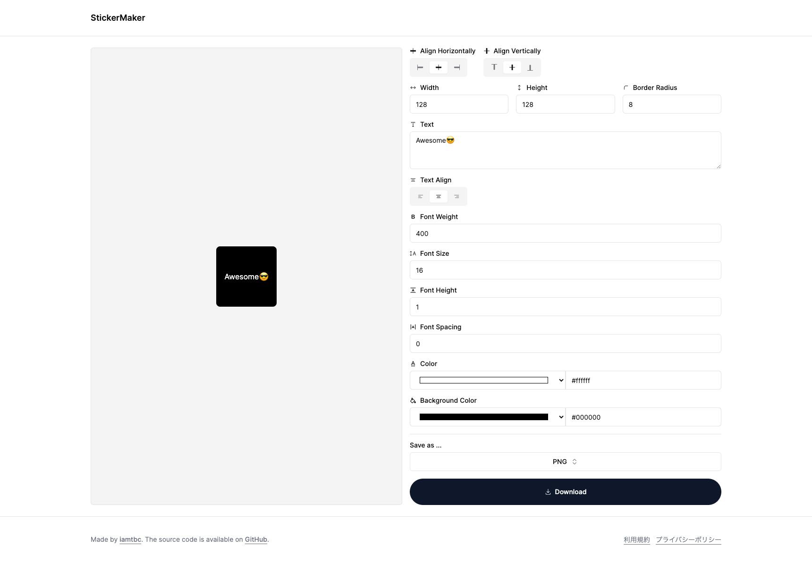

# StickerMaker

StickerMaker is an open-source project for creating custom stickers.



## Features

- Interactive sticker creation tool
- Users can combine text, emojis, and more to craft their unique stickers.

## Dependencies

- [Next.js](https://github.com/vercel/next.js)
- [shadcn/ui](https://github.com/shadcn-ui/ui)
- [html-to-image](https://github.com/bubkoo/html-to-image)

## Development

1. Clone the repository.

```bash
git clone https://github.com/iamtbc/sticker-maker.git
cd sticker-maker
```

2. Run the development server:

```bash
npm run dev
```

Open [http://localhost:3000/sticker-maker](http://localhost:3000/sticker-maker) with your browser to see the result.
